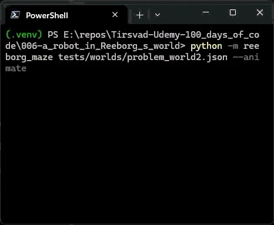

# 🚀 Reeborg Maze

A beginner-friendly Python project that guides a robot through a maze in Reeborg's world by following the right wall, whatever its random start position and direction.

## 📚 Table of Contents

- [Overview](#-overview)
- [Requirements](#-requirements)
- [Setup](#-setup)
- [Run](#-run)
- [Tests](#-tests)
- [License](#-license)
- [Links](#-links)

## 🧭 Overview

This is the final project of day 6 of Udemy's *100 Days of Code: The Complete Python Pro Bootcamp*. The maze is fixed, but the robot starts at a random position and heading, so the program must work from anywhere.

The robot follows the right wall:

1. Walk forward until a wall is hit, then turn left (this puts a wall on the right and avoids infinite loops).
2. Until the goal is reached:
   - if the right side is clear: turn right and move,
   - else if the front is clear: move,
   - else: turn left.

The project contains:

- `src/reeborg_maze/reeborg_script.py` – the script to paste into [Reeborg's world](https://reeborg.ca/reeborg.html?lang=en&mode=python&menu=worlds%2Fmenus%2Freeborg_intro_en.json&name=Maze&url=worlds%2Ftutorial_en%2Fmaze1.json).
- `src/reeborg_maze/maze_solver.py` – the same algorithm as a testable function.
- `src/reeborg_maze/simulator.py` – a small offline simulator that reads Reeborg world JSON files.
- `src/reeborg_maze/visualizer.py` – draws the world as text and animates the robot.
- `tests/` – unit tests and three test worlds with different start headings.

## 📋 Requirements

- Python 3.13 or newer
- No runtime dependencies (pytest is installed as a dev dependency for the tests)
- Optional: [Doxygen](https://www.doxygen.nl/) to build the API documentation

## 🛠️ Setup

Create and activate a local virtual environment, upgrade pip and install the project in editable mode.

Windows (PowerShell):

```powershell
python -m venv .venv
.venv\Scripts\Activate.ps1
python -m pip install --upgrade pip
python -m pip install -e ".[dev]"
```

Linux / macOS:

```bash
python3 -m venv .venv
source .venv/bin/activate
python -m pip install --upgrade pip
python -m pip install -e ".[dev]"
```

## ▶️ Run

In Reeborg's world: open the maze link above, choose Python mode, paste the contents of `src/reeborg_maze/reeborg_script.py` into the editor and press run.

Offline, against a world file:

```bash
python -m reeborg_maze tests/worlds/problem_world.json
```

Watch the robot move in the terminal (optionally pick a start with `X Y HEADING`, where heading is 0=east, 1=north, 2=west, 3=south):

```bash
python -m reeborg_maze tests/worlds/problem_world.json --animate
python -m reeborg_maze tests/worlds/problem_world.json --animate --delay 0.05 --start 1 1 0
```



The robot is drawn as `>` `^` `<` `v`, the goal as `G` and mud as `~~~`.

Build the documentation (written to `docs/html`):

```bash
doxygen Doxyfile
```

## 🧪 Tests

The tests use [pytest](https://pytest.org); each world is solved from every free cell and all four headings.

```bash
python -m pytest -v
```

## 📄 License

[GNU AGPL v3 or later](LICENSE)

## 🔗 Links

- [Repository](https://git.tirsystem.com/Tirsvad-Udemy-100_days_of_code/006-a_robot_in_Reeborg_s_world)
- [Documentation](https://git.tirsystem.com/Tirsvad-Udemy-100_days_of_code/006-a_robot_in_Reeborg_s_world#readme)
- [Issue tracker](https://git.tirsystem.com/Tirsvad-Udemy-100_days_of_code/006-a_robot_in_Reeborg_s_world/issues)
